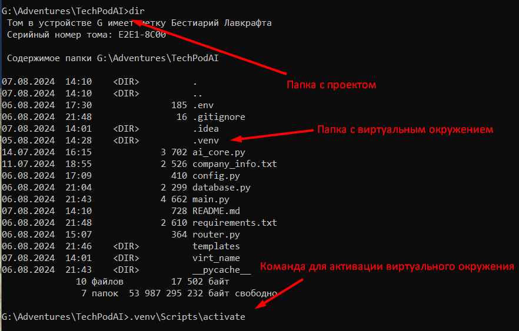
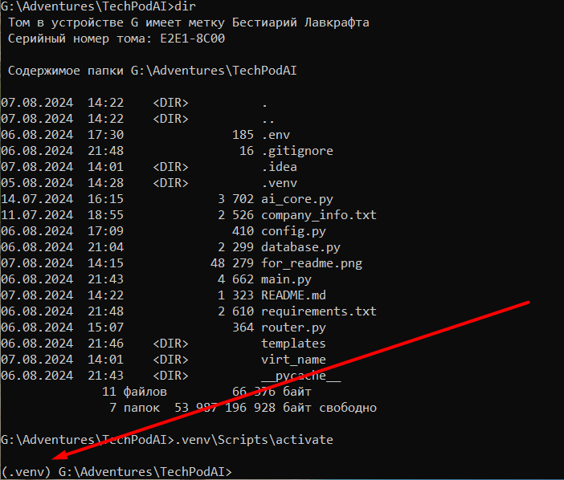
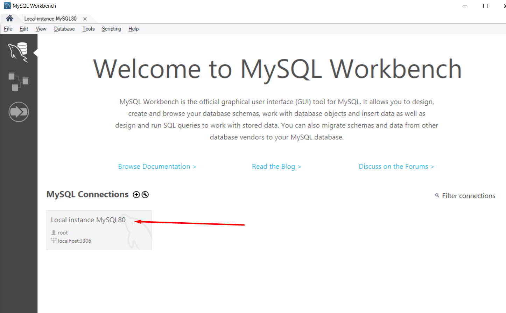
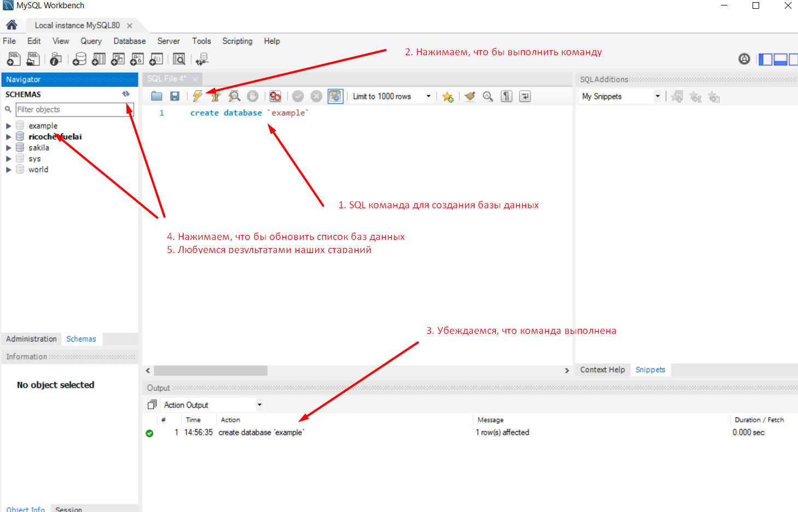
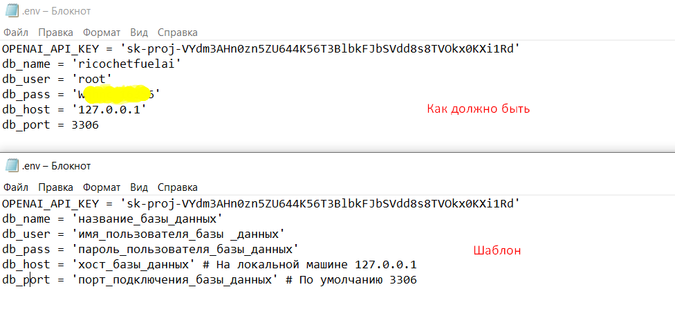
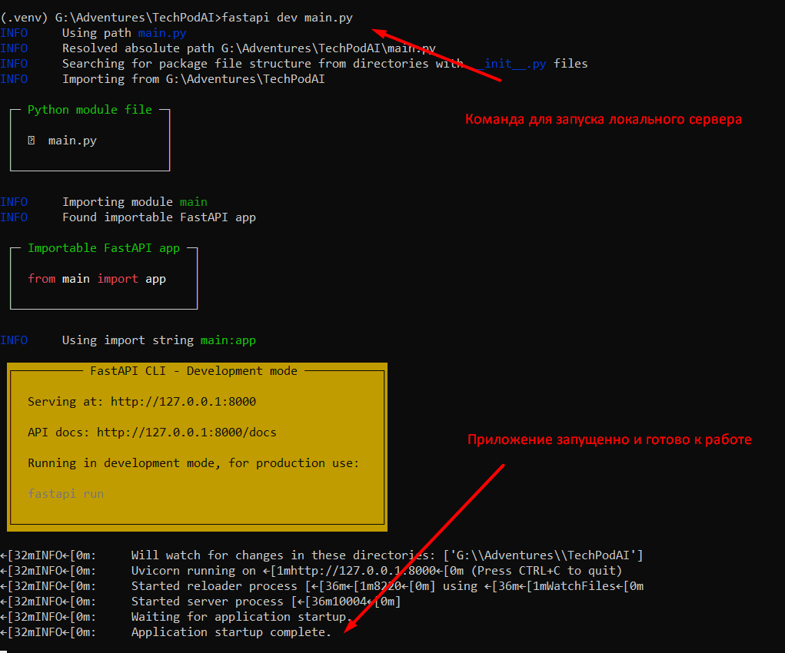
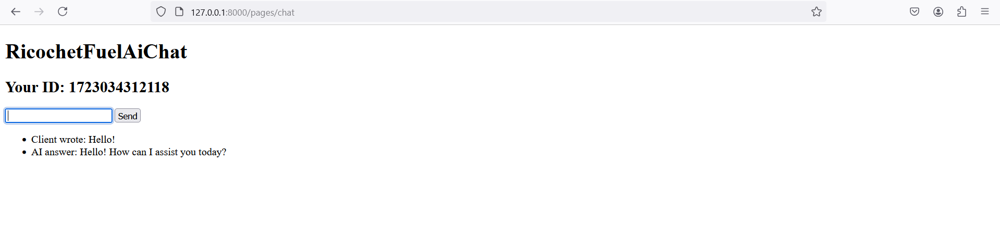

# Установка зависимостей

Первым делом нужно создать виртуально окружение и установить необходимые зависимости для запуска.
Создать виртуальное окружение можно следующей командой выполнив ее в терминале, находясь в папке с проектом:

`python -m venv virt_name`

Где virt_name это название для вашего виртуального окружения. После чего, в папке с проектом должна появиться папка с виртуальным окружением, которая будет называться так как вы указали при создании.
Далее нужно это виртуальное окружение активировать. Сделать это можно все в том же терминале:

Т.е команда для активации виртуального окружения для Windows должна выглядеть следующим образом:

`название_папки_с_виртуальным_окружением\Scripts\activate`

Для MacOS и Linux команда будет следующей:

`source название_папки_с_виртуальным_окружением/bin/activate`

После чего перед указанием текущей директории должно появиться надпись с названием виртуального окружения в скобочках:

Теперь можно переходить к установке зависимостей. Для этого достаточно прописать в том же окне терминала следующую команду:

`pip install -r requirements.txt`

Установка зависимостей может занять какое-то время

# Установка MySQL

Теперь, перед тем как запустить проект, осталось установить базу данных MySQL. Для этого нужно, перейдя по <a href='https://dev.mysql.com/downloads/installer/'>ссылке</a>, скачать установщик (303Мб).
В начале установки нужно будет выбрать один из четырех режимов установки. Нужно выбрать "Все режимы" (или как-то так он называется).

По ходу установки ничего менять не нужно (только если вы знаете что делаете, тогда валяйте😉)

На определенном этапе нужно будет присвоить пароль пользователю root. Он нам в дальнейшем понадобиться.
Так же у вас будет возможность добавить еще пользователей, это уже на ваше усмотрение.

После установки откройте MySQL Workbench 8.0

Далее, выберете подключение:

После чего вас попросят ввести пароль. Можете смело это делать!

Далее, нужно создать базу данных, которую мы будем использовать. Для этого нужно прописать соответствующую команду.
В открывшемся окне будет окно для ввода SQL команд, туда и пропишем:

`CREATE DATABASE 'имя_базы_данных';`

# Файл .env

Последнее, что необходимо сделать, перед запуском - это файл .env с переменными окружениями.
В репозитории уже будет данный файл, его нужно будет только правильно подредактировать

Скаченный вами файл будет называться <kbd>.env.example</kbd>. Его ОБЯЗАТЕЛЬНО нужно переименовать в <kbd>.env</kbd>

# Запуск локального сервера

Теперь все готово для запуска приложения на вашей машине! Для этого вернемся в терминал, перейдем в папку с проектом и запустим виртуальное окружение с установленными зависимостями.
После чего запустим следующую команду:

`fastapi dev main.py `

После чего, должно появиться что-то на подобии следующего:

Строка <kbd>Application startup complete</kbd> свидетельствует о том, что приложение запущено.
Теперь переходим по ссылке http://127.0.0.1:8000/pages/chat где мы увидим следующую страницу

Готово! Пишете в поле для ввода и получаете ответ от ИИ! Круто правда?
Предупреждаю, что ответ может занять несколько секунд!

Если по ходу возникнут вопросы или не предвиденные ситуации - то смело обращайтесь)))
